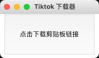

# tiktok-downloader.py  
Tiktok video downloader build by Python.  
  
这是一个超级简单的Tiktok视频下载器。整个UI就只有一个下载按钮。如果你想有更漂亮的桌面下载程序，请移步： [tiktok-downloader](https://github.com/Tairraos/tiktok-downloader) 。  
  
### 运行准备  
本程序需要以下两个Lib支持  
```  
requests==2.27.1  
tenacity==8.0.1  
```  
使用如下命令安装。也可以先跳过此步，尝试直接运行。  
```  
pip install -r requirements.txt  
```  
  
### 运行  
```  
python3 tikdown.py  
```  
  
### 使用方法  
从tiktok app此处点击分享，复制分享链接  
  
  
点击按钮即可下载到指定目录  
  
  
### 更改下载目录  
打开源代码配置下载目录。  
  
### 感谢  
本代码参考了 @Evil0ctal 的 Repo https://github.com/Evil0ctal/Douyin_TikTok_Download_API, 非常感谢。  